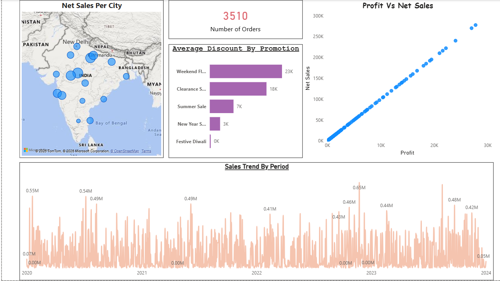
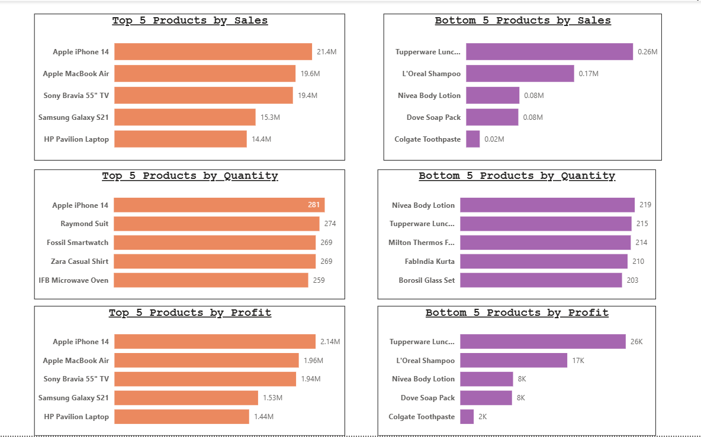
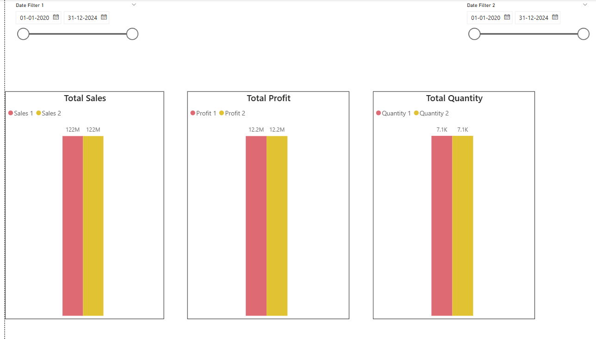

# Retail Sales Analytics Dashboard

## Overview
This project presents an interactive Retail Sales Analytics Dashboard developed using Power BI. The dashboard is designed to analyze retail sales performance, profitability, promotional impact, and product-level trends across multiple cities and categories.

The project focuses on transforming raw transactional retail data into actionable business insights through data visualization and KPI analysis.

---

## Objectives
- Analyze sales and profit trends across different regions and product categories
- Evaluate the effectiveness of promotional campaigns
- Identify top-performing and low-performing products
- Monitor transaction-level sales performance
- Build interactive dashboards for business decision-making

---

## Tools & Technologies
- Power BI
- DAX
- Power Query
- Data Modeling
- Data Visualization

---

## Dashboard Features

### Sales Overview
- Total Sales, Profit, and Order KPIs
- Monthly sales trend analysis
- Region-wise and category-wise performance tracking

### Promotion Analysis
- Promotion effectiveness evaluation
- Sales comparison across promotional campaigns
- Profitability analysis based on discounts and offers

### Product Performance
- Product-level revenue and profit analysis
- Identification of high-performing products
- Comparative category analysis

### Transaction Analysis
- Drill-through transaction reports
- Customer and order-level sales tracking
- Detailed operational insights

---

## Key Insights
- Certain promotional campaigns generated high sales volume but lower profitability
- Technology and Office Supplies categories contributed significantly to revenue
- Regional sales trends showed strong performance variation across cities
- Product-level analysis identified items with high sales but low profit margins

---

## Repository Structure
```text
retail-sales-analytics-powerbi/
│
├── dashboard.pbix
├── dataset.xlsx
├── screenshots/
├── README.md
```

---

## Screenshots

### Sales Dashboard


### Promotion Analysis


### Product Performance


---

## Future Improvements
- Sales forecasting using time-series models
- Customer segmentation analysis
- RFM analysis for customer behavior
- Predictive profitability analysis

---

## Author
Hayat Faruquee
